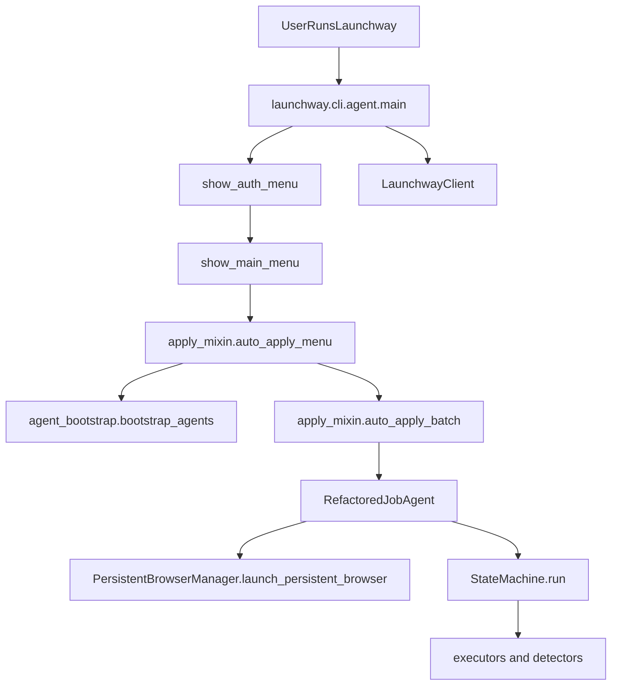

# End-to-End Architecture and Audit Report

Date: 2026-04-10  
Scope: CLI runtime, Flask API surface, core agents/executors, integrations, secrets, and verification status.

## 1) System Runtime Flow (What Actually Runs)

Primary entrypoint is `launchway/cli/agent.py` (`main()`), which configures logging/environment, enforces version checks, and enters `CLIJobAgent.run()`.  
Apply workflows run through `launchway/cli/mixins/apply.py`, which bootstraps `Agents` code and instantiates `RefactoredJobAgent` from `Agents/job_application_agent.py`.

### Key behavior notes
- The code supports two agent-loading paths:
  - Local plaintext `Agents/` (`LAUNCHWAY_USE_LOCAL_AGENTS` path).
  - Decrypted runtime path via `launchway/agent_bootstrap.py` from `launchway/encrypted_agents`.
- `RefactoredJobAgent.process_link()` is the central orchestrator for form automation and state transitions.
- `Agents/components/router/state_machine.py` drives `start -> ... -> success|fail` with loop and stuck checks.

## 2) API Surface and Endpoint Risk Map

All HTTP endpoints are centralized in `server/api_server.py` (Flask).  
Auth controls are primarily `@require_auth` and `@require_admin` from `server/auth.py`, with rate limits from `server/rate_limiter.py`.

### Endpoint domains reviewed
- Health and readiness
- Profile/resume/settings
- Search/tailoring/credits
- Auth/account/beta
- Admin and backups
- CLI endpoints (`/api/cli/*`)
- OAuth + picker
- Projects and async jobs
- Public page reactions/visits

### High-priority API findings
1. Duplicate health route definitions for `/health` and `/api/health` in one file (operational ambiguity).
2. Inconsistent admin checks:
   - `@require_admin` in most admin routes.
   - Separate manual `os.getenv('ADMIN_EMAILS').split(',')` checks in beta admin routes.
   - Separate `rate_limiter.ADMIN_EMAILS` use in credits logic.
3. Sensitive endpoint `/api/cli/agent-key` returns runtime decryption key + shared Gemini key to authenticated clients.
4. Public write endpoints for reactions/visits can be abused without auth.
5. CORS uses credential support; correctness depends on strict production `CORS_ORIGINS`.

## 3) Core Agent Deep Review

Reviewed modules:
- `Agents/job_application_agent.py`
- `Agents/components/executors/generic_form_filler_v2_enhanced.py`
- `Agents/components/executors/field_interactor_v2.py`
- `Agents/components/executors/ats_dropdown_handlers_v2.py`
- `Agents/resume_tailoring_agent.py`
- `Agents/systematic_tailoring_complete.py`
- `Agents/persistent_browser_manager.py`

### Top reliability and maintainability findings
1. **Critical cleanup bug pattern**: `run_links_with_refactored_agent()` `finally` block can reference `agent` even if instantiation failed.
2. **Global async singleton complexity**: module-level Playwright singleton/loop ID creates concurrency and lifecycle risk.
3. **Background task observability gap**: `asyncio.create_task` paths without robust exception handling.
4. **Exception hygiene issues**: many broad `except Exception` and some bare `except:` blocks that can mask real failures.
5. **God-file concentration**: orchestration and execution logic concentrated in very large modules, increasing defect and merge risk.

## 4) Integrations, Secrets, and PII Boundaries

### External integrations observed
- Launchway backend via `launchway/api_client.py` (`requests.Session`).
- Google OAuth token exchange (`server/google_oauth_service.py`).
- Resend email API (`server/email_service.py`).
- Job APIs in `Agents/job_api_adapters.py` (RapidAPI/JSearch, Adzuna, SerpAPI, Google CSE, The Muse, TheirStack).
- Gemini/Google GenAI usage across agent and server modules.

### Secret/key handling observations
- Runtime and model keys sourced from env and served to CLI bootstrap through authenticated endpoint.
- `launchway/agent_bootstrap.py` stores diagnostics that include key fields; this increases accidental leak risk if diagnostics are logged/exposed.
- OAuth service has a generated fallback encryption key if env key is absent; this is fragile for production token persistence.

### PII boundaries
- User profiles/resume data, account data, and job application payloads contain high-sensitivity information.
- Some logging includes user/job context fields and should be constrained/redacted in production paths.

## 5) Verification Pass (What Was Actually Executed)

### Executed checks
- `python -m unittest discover -s Testing -v`  
  - Result: **5 tests passed**.
- `python -m py_compile` on critical reviewed files  
  - Result: **Syntax compile passed** for audited high-risk modules.

### Environment limitations encountered
- `pytest` is not installed in current environment (`No module named pytest`), so existing pytest-based flow was not runnable directly.
- Full live E2E scenarios (auth/login, credits consume, apply on external ATS, OAuth callback) were not executed because they depend on external services, valid runtime credentials, and browser-interactive setup.

## 6) Risk Register (Prioritized)

### P0
- Agent cleanup path can mask original failure (`agent` used in `finally` before guaranteed assignment).
- Admin authorization logic is inconsistent across routes and sources.
- Sensitive key-serving endpoint (`/api/cli/agent-key`) requires hardening and tighter controls.

### P1
- Broad exception swallowing in core automation can hide regressions.
- Global Playwright singleton pattern increases lifecycle/concurrency fragility.
- Public write analytics endpoints should have stronger abuse controls.

### P2
- Very large modules reduce reviewability and increase defect rate over time.
- Mixed logging styles (`logging` and `loguru`) reduce observability consistency.
- Dual plaintext/encrypted source paths increase drift risk.

## 7) First 5 Fixes (Recommended Execution Order)

1. Fix `agent`-cleanup guard in `run_links_with_refactored_agent()` and add regression test for constructor-failure path.
2. Consolidate admin checks to a single `@require_admin` strategy and remove manual/env split checks.
3. Harden `/api/cli/agent-key`: scope keys, add strict audit logging, and reduce key exposure lifetime.
4. Replace bare/broad exception blocks in core execution hot paths with typed exceptions + structured logs.
5. Add protection and rate limits to public reaction/visit write endpoints (or require auth for destructive operations).

## 8) Next Review Cycle Recommendations

- Create a dedicated endpoint contract test suite using Flask test client for auth and privilege boundaries.
- Add E2E smoke tests for: login, credits consume, one tailoring path, one apply path.
- Start modularizing `RefactoredJobAgent` into bounded components with explicit interfaces.
